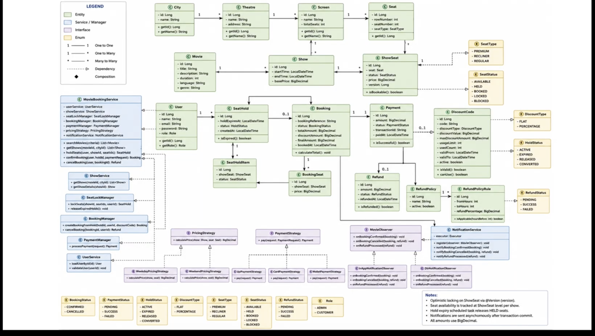
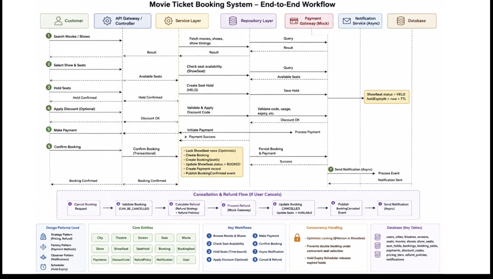

# Movie Ticket Booking System

A backend-first movie ticket booking platform for multiple cities, theatres, screens, shows, and seat-level inventory. The service covers the complete customer journey—discovery, temporary seat holds, pricing, discounts, payment, booking, cancellation, refunds, and notifications—while protecting seats from concurrent double-booking.

> **Demo video:** [Watch the project walkthrough on Google Drive](https://drive.google.com/file/d/1f8VRVZHWg1UFAXtQpgPcNKXIAegjTdLU/view)

## Highlights

- Multi-city catalogue with theatres, screens, reusable seat layouts, movies, and shows
- Per-show seat inventory through `ShowSeat`
- Configurable, time-bound seat holds with automatic expiry
- Optimistic locking with `@Version` to serialize competing seat updates
- Regular, premium, and weekend pricing strategies
- Flat and percentage discount codes with validity and usage constraints
- Mock card, UPI, and wallet payment strategies
- Configurable time-band refund policies and cancellation flow
- Asynchronous booking, cancellation, and refund notifications
- JWT authentication and role-based authorization for `ADMIN` and `CUSTOMER`
- Validation, centralized error handling, unit tests, and integration tests

## Architecture

The application is a modular Spring Boot monolith. Controllers expose REST endpoints, services own transactional business workflows, Spring Data JPA repositories handle persistence, and domain events decouple notifications from the booking transaction.

### Domain model



### End-to-end workflow



The critical booking path is:

1. Browse a city’s movies and shows.
2. Select a show and inspect its per-show seat availability.
3. Hold available seats for a configurable period (10 minutes by default).
4. Optionally apply one valid discount code.
5. Process payment through a mocked payment strategy.
6. Convert the hold into a confirmed booking in a transaction.
7. Publish an event and persist the notification asynchronously.

Cancellation validates ownership and booking state, calculates the applicable refund from configured time bands, releases seats, records the refund, and emits cancellation/refund notifications.

## Concurrency and consistency

Physical seats belong to a screen, while availability belongs to a `ShowSeat` record for a particular show. Each `ShowSeat` contains a JPA `@Version` field. Concurrent attempts therefore cannot successfully update the same stale seat version: one transaction succeeds and competing transactions fail cleanly instead of allocating the seat twice.

Seat holds use the same inventory records. A scheduled task runs every 30 seconds and releases `HELD` seats whose hold has expired. Booking confirmation revalidates the hold, its owner, its expiry, and every selected seat within the transactional boundary.

## Roles

| Role | Capabilities |
|---|---|
| `ADMIN` | Manage cities, theatres, screens, seat layouts, movies, shows, pricing tiers, discount codes, and refund policies |
| `CUSTOMER` | Browse movies and shows, inspect seats, create holds, confirm or cancel bookings, and view booking history |

## Technology choices

| Area | Choice | Reasoning |
|---|---|---|
| Language | Java 21 | Modern Java runtime, strong typing, and mature concurrency support |
| Framework | Spring Boot 3.3.5 | Fast REST development and integrated validation, security, persistence, scheduling, and async execution |
| Persistence | PostgreSQL + Spring Data JPA | Transactional relational model and optimistic locking support |
| Tests | H2, JUnit 5, Spring Boot Test | Fast isolated tests plus HTTP-level integration coverage |
| Security | Spring Security + JWT | Stateless basic authentication appropriate to the stated scope |
| Payments | Strategy + factory, mocked gateways | Keeps payment methods extensible without an external provider dependency |
| Notifications | Transactional events + `@Async` | Avoids blocking the booking response while preserving transaction ordering |

## REST API summary

All endpoints are rooted at `/api`.

| Area | Method and path | Access |
|---|---|---|
| Authentication | `POST /auth/register`, `POST /auth/login` | Public |
| Movies | `GET /movies`, `GET /movies/{id}` | Public |
| Shows | `GET /cities/{cityId}/shows`, `GET /shows/{id}` | Public |
| Seats | `GET /shows/{id}/seats` | Public |
| Holds | `POST /holds` | Customer |
| Bookings | `POST /bookings` | Customer |
| Cancellation | `PATCH /bookings/{id}/cancel` | Customer |
| History | `GET /bookings/history` | Customer |
| Administration | `/admin/**` | Admin |

The full contract is available in [swagger.yaml](swagger.yaml), with a browsable static version in [swagger.html](swagger.html).

## Running locally

### Prerequisites

- Java 21
- Maven 3.9+
- PostgreSQL 15+ (or Docker for the included development database)

### 1. Start PostgreSQL

Using the supplied development Compose file:

```bash
docker compose up -d postgres
```

Containerization is included only as a local-development convenience; deployment infrastructure is intentionally outside the project scope.

### 2. Configure the environment

```bash
export DB_URL='jdbc:postgresql://localhost:5432/moviedb'
export DB_USERNAME='postgres'
export DB_PASSWORD='postgres'
export JWT_SECRET='replace-with-a-long-base64-encoded-secret'
```

`DB_PASSWORD` should always be provided outside local demo use. Replace the default JWT secret before using the service in any shared environment.

### 3. Start the API

```bash
mvn spring-boot:run
```

The API starts at `http://localhost:8080`.

### 4. Authenticate

Register or log in through `/api/auth`. Send the returned token with protected requests:

```text
Authorization: Bearer <token>
```

Demo seed data creates an administrator for local evaluation; see `DataInitializer` and change its credentials for any non-demo environment.

## Testing

Run the complete suite:

```bash
mvn test
```

Coverage focuses on:

- authentication and authorization boundaries
- admin catalogue operations
- the hold → payment → booking → cancellation workflow
- pricing strategy selection
- payment gateway selection
- configurable refund calculation
- HTTP validation and error responses

Test classes are under `src/test/java/com/moviebooking`, with H2-specific configuration in `src/test/resources/application.properties`.

## Assumptions and scoping decisions

1. A physical seat belongs to one screen; show-specific price and availability live in `ShowSeat`.
2. A screen cannot host overlapping shows.
3. A hold belongs to one customer and cannot be confirmed by another customer.
4. Hold duration is configured with `app.hold.duration.minutes` and defaults to 10 minutes.
5. Optimistic locking is sufficient for the current single-database architecture; clients receive a conflict rather than an automatic hidden retry.
6. One discount code may be applied to a booking. Codes may be inactive, date-limited, usage-limited, flat, or percentage-based with a maximum discount.
7. Pricing depends on seat type and weekday/weekend classification. Monetary calculations use `BigDecimal` at transaction boundaries.
8. Payment providers are deliberately mocked. A successful mock payment is persisted with its booking; production reconciliation and idempotency keys are not implemented.
9. Refunds are calculated from configurable hours-before-show bands. The refund gateway is mocked.
10. Notifications are persisted asynchronously after domain events; actual email, SMS, and push delivery are outside scope.
11. JWT authentication is intentionally basic: OAuth, SSO, MFA, token refresh, and account recovery are outside scope.
12. The solution is a modular monolith backed by one relational database. Microservices, distributed locks, and multi-region consistency are unnecessary for this exercise.
13. PostgreSQL is the runtime database; H2 is used only for automated tests.
14. UI, production deployment, CI/CD, and production-grade observability are intentionally excluded as required.

## Design patterns

- **Strategy:** weekday/weekend pricing and time-based refunds
- **Factory:** card, UPI, and wallet payment gateway selection
- **Observer/events:** non-blocking booking, cancellation, and refund notifications
- **Repository:** persistence abstraction for aggregate entities
- **Scheduler:** release of expired seat holds

## Project structure

```text
src/main/java/com/moviebooking/
├── config/       # security, async execution, and seed configuration
├── controller/   # public, customer, and admin REST endpoints
├── dto/          # validated request and response contracts
├── entity/       # JPA domain model
├── event/        # booking and refund domain events
├── listener/     # asynchronous notification handlers
├── payment/      # mocked payment strategies and factory
├── pricing/      # pricing strategies
├── refund/       # refund strategy
├── repository/   # Spring Data repositories
├── scheduler/    # expired-hold release task
├── security/     # JWT filter and user details service
└── service/      # transactional use cases
```

Additional design material:

- [Low-level design](lowleveldesign.md)
- [Implementation plan](movie-booking-implementation-plan.md)
- [Demo script](demo-script.md)
- [OpenAPI specification](swagger.yaml)

## AI-assisted development workflow

AI was used as a development assistant for requirement decomposition, low-level design, implementation planning, code generation, test planning, and documentation. The generated work was reviewed against the domain rules and verified with automated tests rather than accepted without validation.

Submission artifacts retained in the repository include:

- [`CLAUDE.md`](CLAUDE.md), containing the development-agent guidance
- `.claude/skills/lld-design/`, the low-level-design skill used during development
- [`movie-booking-implementation-plan.md`](movie-booking-implementation-plan.md), the raw implementation plan
- [`lowleveldesign.md`](lowleveldesign.md), the detailed design record
- [`demo-script.md`](demo-script.md), the video walkthrough plan

## Current limitations and production follow-ups

- Replace mocked payments and notifications with idempotent external integrations.
- Externalize and rotate all secrets; remove demo credentials.
- Add refresh/revocation support to JWT authentication if required.
- Add retry/dead-letter handling for asynchronous delivery.
- Add database migrations (Flyway or Liquibase) instead of `ddl-auto=update`.
- Add pagination, rate limiting, audit trails, metrics, tracing, and production health checks.
- Add load and stress tests for high-contention shows.

## Repository

[github.com/Manya1609/MovieTicketBookingSystem--DMG](https://github.com/Manya1609/MovieTicketBookingSystem--DMG)
