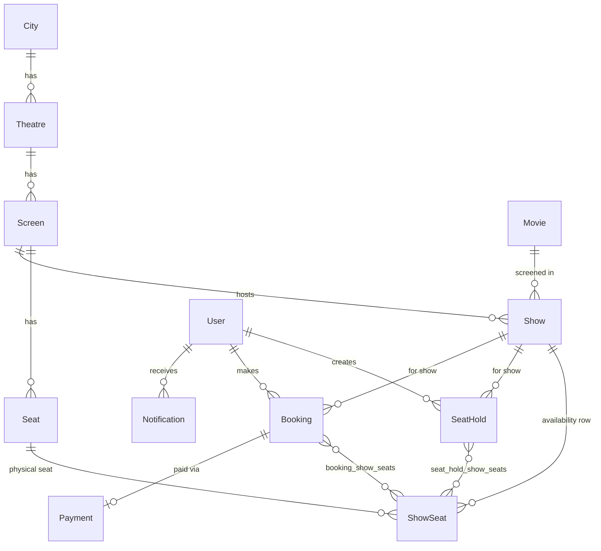

# Movie Booking System — Low-Level Design

## 1. Overview

A multi-city, multi-theatre movie ticket booking platform built on Java 21 + Spring Boot 3.3.5. Customers browse shows, hold and book seats with time-bound protection against concurrent selection, pay via a mocked payment gateway, and cancel with configurable refund policies. Admins manage the full catalogue. Concurrent booking conflicts are prevented via JPA optimistic locking. Notifications are delivered asynchronously after transaction commit.

---

## 2. Problem Statement (Clarified)

Multiple cities, each with multiple theatres, each with multiple screens and seat layouts. Customers can search movies by city, view show timings and seat availability, hold seats temporarily, confirm bookings via payment, and cancel with a time-based refund. Admins configure every catalogue entity including pricing tiers, discount codes, and refund policies. The system must guarantee no double-booking under concurrent attempts.

---

## 3. Scope

**In scope:**
- Browse movies and shows by city; view seat availability
- Time-bound seat hold (configurable duration, auto-expiry scheduler)
- Booking flow: hold → optional discount → payment → confirmation
- Cancellation with configurable time-band refund policies
- Pricing tiers keyed by SeatType × DayType
- Discount codes (FLAT and PERCENTAGE, usage-limited)
- Asynchronous notifications (BOOKING_CONFIRMED, BOOKING_CANCELLED, REFUND_PROCESSED)
- Full admin CRUD for all catalogue entities
- JWT stateless authentication and role-based access control
- Mocked payment gateway (UPI, Card, Wallet)
- Hold-expiry background scheduler

**Out of scope:**
- UI / frontend
- Real payment gateway integration
- Real notification delivery channel (email, SMS, push)
- Production database configuration *(open item — see §16)*

---

## 4. Assumptions

| # | Assumption |
|---|---|
| A1 | One screen runs at most one show at any given time. |
| A2 | Physical seat layout belongs to a Screen; per-show availability is tracked via ShowSeat. |
| A3 | Payment gateway integration is mocked for all three methods (UPI, Card, Wallet). |
| A4 | Notifications are simulated via Spring async event listeners writing Notification records; no real channel. |
| A5 | Hold duration is configurable via `app.hold.duration.minutes` (default 10). |
| A6 | Optimistic locking (`@Version` on ShowSeat) is the primary mechanism to prevent double-booking. |
| A7 | A maximum of one discount code may be applied per booking. |
| A8 | JWT stateless auth; no server-side session state. |
| A9 | Monolithic Spring Boot application; H2 in-memory database for development. |
| A10 | `BookingStatus.PENDING` and `PaymentStatus.PENDING` are reserved for a future async payment flow; the current synchronous flow creates bookings directly as CONFIRMED and only persists successful payments. |
| A11 | `PricingTier.multiplier` is stored as `double`; precision is preserved by using `BigDecimal.valueOf(double)` when multiplying with `basePrice`. Migration to `BigDecimal` is tracked as a future improvement. |

---

## 5. Roles & Permissions

| Role | Can | Cannot |
|---|---|---|
| ADMIN | Manage cities, theatres, screens, movies, shows, bulk seat creation, pricing tiers, discount codes, refund policies | Hold seats, book tickets, cancel bookings |
| CUSTOMER | Browse movies/shows/seats, create seat holds, confirm bookings, cancel bookings, view booking history | Manage any catalogue entity |

---

## 6. Core Functionalities

| Area | Feature | Role(s) |
|---|---|---|
| Browse | Search movies; view theatres, shows, seat availability | Public / CUSTOMER |
| Seat Hold | Temporarily hold one or more seats for a show; expires after configurable duration | CUSTOMER |
| Booking | Confirm a hold into a booking via payment; optional discount code | CUSTOMER |
| Cancellation | Cancel a confirmed booking; refund computed by time-band policy | CUSTOMER |
| Pricing | Calculate per-seat price from PricingTier (SeatType × DayType) | System |
| Discounts | Apply a single FLAT or PERCENTAGE discount code per booking | CUSTOMER |
| Refund | Compute refund amount from configured time-band RefundPolicies | System |
| Notifications | Async delivery of booking/cancellation/refund events | System |
| Catalogue Admin | CRUD for all catalogue entities | ADMIN |
| Hold Expiry | Background sweep every 30 s; release HELD seats from expired holds | System |

---

## 7. Domain Model

### 7.1 Entities

#### User

| Field | Type | Notes |
|---|---|---|
| id | Long | PK |
| name | String | required |
| email | String | unique, required |
| password | String | BCrypt-hashed |
| role | Role | required |

Table name: `users` (reserved word avoidance)

---

#### City

| Field | Type | Notes |
|---|---|---|
| id | Long | PK |
| name | String | unique, required |
| theatres | List\<Theatre\> | OneToMany, cascade ALL |

---

#### Theatre

| Field | Type | Notes |
|---|---|---|
| id | Long | PK |
| name | String | required |
| address | String | |
| city | City | ManyToOne LAZY, FK city_id |
| screens | List\<Screen\> | OneToMany, cascade ALL |

---

#### Screen

| Field | Type | Notes |
|---|---|---|
| id | Long | PK |
| name | String | required |
| totalSeats | int | denormalised count |
| theatre | Theatre | ManyToOne LAZY, FK theatre_id |
| seats | List\<Seat\> | OneToMany, cascade ALL |

---

#### Seat

| Field | Type | Notes |
|---|---|---|
| id | Long | PK |
| rowNumber | int | |
| seatNumber | int | |
| seatType | SeatType | required |
| screen | Screen | ManyToOne LAZY, FK screen_id |

---

#### Movie

| Field | Type | Notes |
|---|---|---|
| id | Long | PK |
| title | String | required |
| description | String | max 1000 |
| duration | int | minutes |
| language | String | |
| genre | String | |

---

#### Show

| Field | Type | Notes |
|---|---|---|
| id | Long | PK |
| movie | Movie | ManyToOne LAZY, FK movie_id |
| screen | Screen | ManyToOne LAZY, FK screen_id |
| startTime | LocalDateTime | required |
| endTime | LocalDateTime | required |

Table name: `shows` (reserved word avoidance). A screen may not host overlapping shows.

---

#### ShowSeat *(availability record — one per Seat per Show)*

| Field | Type | Notes |
|---|---|---|
| id | Long | PK |
| show | Show | ManyToOne LAZY, FK show_id |
| seat | Seat | ManyToOne **EAGER**, FK seat_id |
| status | SeatStatus | default AVAILABLE |
| version | Long | **@Version** — optimistic locking |

The `@Version` field is the primary concurrency guard. All concurrent seat-selection conflicts surface as `ObjectOptimisticLockingFailureException` → HTTP 409.

---

#### SeatHold *(temporary reservation before payment)*

| Field | Type | Notes |
|---|---|---|
| id | Long | PK |
| customer | User | ManyToOne LAZY, FK customer_id |
| show | Show | ManyToOne LAZY, FK show_id |
| showSeats | List\<ShowSeat\> | ManyToMany EAGER via `seat_hold_show_seats` |
| createdAt | LocalDateTime | |
| expiresAt | LocalDateTime | `createdAt + holdDurationMinutes` |
| expired | boolean | default false; set true on booking or scheduler expiry |

---

#### Booking

| Field | Type | Notes |
|---|---|---|
| id | Long | PK |
| customer | User | ManyToOne LAZY, FK customer_id |
| show | Show | ManyToOne LAZY, FK show_id |
| bookedSeats | List\<ShowSeat\> | ManyToMany EAGER via `booking_show_seats` |
| totalAmount | BigDecimal | precision 10, scale 2 |
| bookingStatus | BookingStatus | created as CONFIRMED |
| bookedAt | LocalDateTime | |

---

#### Payment *(1:1 with Booking; created only on payment success)*

| Field | Type | Notes |
|---|---|---|
| id | Long | PK |
| booking | Booking | OneToOne LAZY, FK booking_id |
| amount | BigDecimal | precision 10, scale 2 |
| paymentMethod | PaymentMethod | |
| paymentStatus | PaymentStatus | always SUCCESS when persisted |
| transactionId | String | from gateway |

---

#### DiscountCode

| Field | Type | Notes |
|---|---|---|
| id | Long | PK |
| code | String | unique, required |
| discountType | DiscountType | |
| discountValue | BigDecimal | precision 10, scale 2 |
| validFrom | LocalDate | |
| validTill | LocalDate | |
| maxUsage | int | |
| currentUsage | int | default 0 |

> ⚠️ **Open enhancement:** `currentUsage` increment is not protected by optimistic locking. Under concurrent bookings with the same code, `currentUsage` can exceed `maxUsage`. Fix: add `@Version` to `DiscountCode`, or replace the read-then-increment with a single `UPDATE discount_code SET current_usage = current_usage + 1 WHERE id = ? AND current_usage < max_usage` JPQL update that returns the updated row count; treat a 0-row result as "usage limit reached."

---

#### PricingTier *(keyed by SeatType × DayType)*

| Field | Type | Notes |
|---|---|---|
| id | Long | PK |
| seatType | SeatType | |
| dayType | DayType | |
| basePrice | BigDecimal | precision 10, scale 2 |
| multiplier | double | see Assumption A11 |

Four rows cover all combinations: REGULAR_WEEKDAY, REGULAR_WEEKEND, PREMIUM_WEEKDAY, PREMIUM_WEEKEND.

**Price formula:** `basePrice × multiplier` (BigDecimal × BigDecimal.valueOf(multiplier), RoundingMode.HALF_UP, scale 2).

---

#### RefundPolicy

| Field | Type | Notes |
|---|---|---|
| id | Long | PK |
| minHoursBeforeShow | int | lower bound of time band |
| refundPercentage | int | 0–100 |

Example bands: `≥12h → 100%`, `≥4h → 50%`, `≥1h → 25%`, `<1h → 0%`. Admin-configurable.

---

#### Notification

| Field | Type | Notes |
|---|---|---|
| id | Long | PK |
| user | User | ManyToOne LAZY, FK user_id |
| type | NotificationType | |
| message | String | max 1000 |
| status | NotificationStatus | default PENDING; set to SENT by listener |

---

### 7.2 Enums

| Enum | Values | Notes |
|---|---|---|
| `Role` | ADMIN, CUSTOMER | |
| `SeatType` | REGULAR, PREMIUM | |
| `DayType` | WEEKDAY, WEEKEND | Derived from show.startTime day-of-week |
| `SeatStatus` | AVAILABLE, HELD, BOOKED | Drives ShowSeat state machine |
| `BookingStatus` | **PENDING** *(reserved — see A10)*, CONFIRMED, CANCELLED, REFUNDED | |
| `PaymentStatus` | **PENDING** *(reserved — see A10)*, SUCCESS, FAILED | |
| `PaymentMethod` | UPI, CARD, WALLET | Selects gateway at runtime |
| `DiscountType` | FLAT, PERCENTAGE | |
| `NotificationType` | BOOKING_CONFIRMED, BOOKING_CANCELLED, REFUND_PROCESSED, **SHOW_REMINDER** *(future — see §15)* | |
| `NotificationStatus` | PENDING *(entity default)*, SENT, FAILED | |

---

### 7.3 Relationships

| Relationship | Cardinality | Ownership / Cascade |
|---|---|---|
| City → Theatre | 1:N | City owns; cascade ALL (deleting a city cascades to theatres) |
| Theatre → Screen | 1:N | Theatre owns; cascade ALL |
| Screen → Seat | 1:N | Screen owns; cascade ALL |
| Movie → Show | 1:N | Show references Movie; no cascade |
| Screen → Show | 1:N | Show references Screen; no cascade |
| Show → ShowSeat | 1:N | ShowSeat references Show; no cascade |
| Seat → ShowSeat | 1:N | ShowSeat references Seat; no cascade |
| User → SeatHold | 1:N | SeatHold references User; no cascade |
| SeatHold ↔ ShowSeat | N:M | Join table `seat_hold_show_seats`; no cascade |
| User → Booking | 1:N | Booking references User; no cascade |
| Booking ↔ ShowSeat | N:M | Join table `booking_show_seats`; no cascade |
| Booking → Payment | 1:1 | Payment references Booking; no cascade |
| User → Notification | 1:N | Notification references User; no cascade |

---

### 7.4 ER Diagram

---

## 8. Workflows

### 8.1 Booking Flow

**Happy path** (all steps inside single `@Transactional`):

1. Customer calls `POST /api/holds` with `{showId, seatIds[]}`.
2. System loads Show; fetches ShowSeats matching the seat IDs.
3. Guard: every ShowSeat.status == AVAILABLE → else 400.
4. Set each ShowSeat.status = HELD; save (optimistic lock fires on version mismatch → 409).
5. Create SeatHold with `expiresAt = now + holdDurationMinutes`; save.
6. Return SeatHoldResponse with `holdId` and `expiresAt`.

7. Customer calls `POST /api/bookings` with `{holdId, paymentMethod, discountCode?}`.
8. Load hold; guard: hold belongs to customer and `!expired && expiresAt > now` → else 400.
9. Determine DayType from `show.startTime` (SAT/SUN → WEEKEND, else WEEKDAY).
10. For each ShowSeat in hold: look up PricingTier by (seatType × dayType); compute `basePrice × multiplier`; accumulate `totalAmount`.
11. If discount code provided: validate active, within usage limit; compute discount; increment `currentUsage`.
12. Call `PaymentGatewayFactory.getGateway(paymentMethod).process(totalAmount, txRef)`.

**Payment failure path:**
- On `PaymentStatus != SUCCESS`: **reset all ShowSeats back to AVAILABLE, mark hold.expired = true**, then throw BusinessException 400. Seats are immediately available again; customer does not wait for the scheduler.

**Payment success path (continued):**

13. Mark each ShowSeat.status = BOOKED; save.
14. Create Booking(status=CONFIRMED, bookedAt=now, bookedSeats=hold.showSeats); save.
15. Create Payment(status=SUCCESS, transactionId=...); save.
16. Mark hold.expired = true; save.
17. Publish `BookingConfirmedEvent` (picked up asynchronously after commit).
18. Return BookingResponse.

---

### 8.2 Cancellation Flow

**Happy path** (single `@Transactional`):

1. Customer calls `PATCH /api/bookings/{id}/cancel`.
2. Load booking; guard: belongs to customer → else 400.
3. Guard: `bookingStatus == CONFIRMED` → else 400.
4. Compute `hoursBeforeShow = ChronoUnit.HOURS(now, show.startTime)`.
5. Guard: `hoursBeforeShow >= 0` (show not started) → else 400.
6. Query `RefundPolicyRepository.findBestMatchingPolicy(hoursBeforeShow)` → refundPercentage (0 if no policy found).
7. Compute `refundAmount = totalAmount × refundPercentage / 100` (scale 2, HALF_UP).
8. Set each ShowSeat.status = AVAILABLE; save.
9. Set booking.bookingStatus = REFUNDED (if refundAmount > 0) or CANCELLED (if refundAmount = 0); save.
10. Publish `BookingCancelledEvent`; if refundAmount > 0 also publish `RefundProcessedEvent`.
11. Return BookingResponse.

---

### 8.3 Hold Expiry (Scheduler)

`SeatHoldExpiryScheduler` runs every 30 s (`@Scheduled(fixedDelay=30000)`) in its own `@Transactional`:

1. Query all SeatHolds where `!expired AND expiresAt < now`.
2. For each hold: for each ShowSeat where status == HELD → set AVAILABLE; save ShowSeat.
3. Set hold.expired = true; save hold.

---

### 8.4 Async Notifications

`NotificationEventListener` handles events with `@Async + @TransactionalEventListener(AFTER_COMMIT) + @Transactional(REQUIRES_NEW)`:

- `BookingConfirmedEvent` → create Notification(type=BOOKING_CONFIRMED, status=SENT).
- `BookingCancelledEvent` → create Notification(type=BOOKING_CANCELLED, status=SENT).
- `RefundProcessedEvent` → create Notification(type=REFUND_PROCESSED, status=SENT).

The `REQUIRES_NEW` propagation with `AFTER_COMMIT` ensures the booking transaction is committed before the listener reads the booking, preventing lazy-load failures in the async thread.

---

## 9. State Transitions

### 9.1 ShowSeat

| From | Event | Guard | To | Side effects |
|---|---|---|---|---|
| — | Show created / seat provisioned | — | AVAILABLE | Initial state |
| AVAILABLE | createHold | all seats AVAILABLE | HELD | — |
| HELD | booking confirmed | — | BOOKED | hold.expired=true |
| HELD | payment failed | — | AVAILABLE | hold.expired=true |
| HELD | hold expiry (scheduler) | expiresAt < now | AVAILABLE | hold.expired=true |
| BOOKED | booking cancelled | — | AVAILABLE | booking→CANCELLED or REFUNDED |

### 9.2 Booking

| From | Event | Guard | To | Side effects |
|---|---|---|---|---|
| — | payment SUCCESS | — | CONFIRMED | seats→BOOKED, Payment created, BookingConfirmedEvent |
| CONFIRMED | cancel | show not yet started | CANCELLED | seats→AVAILABLE, BookingCancelledEvent |
| CONFIRMED | cancel | show not yet started, refund>0 | REFUNDED | seats→AVAILABLE, BookingCancelledEvent, RefundProcessedEvent |
| CANCELLED | — | terminal | — | — |
| REFUNDED | — | terminal | — | — |

*`BookingStatus.PENDING` is defined but reserved for a future async payment flow (see A10).*

### 9.3 Payment

Payment records are only persisted on gateway `SUCCESS`. `PaymentStatus.PENDING` and `FAILED` are reserved for a future async payment flow (see A10). No state transitions on the persisted record.

### 9.4 SeatHold Lifecycle

SeatHold uses a boolean `expired` flag rather than a status enum. Created with `expired=false`; marked `expired=true` by booking confirmation, payment failure rollback, or the expiry scheduler. No further state changes after expiry.

---

## 10. APIs

### Auth

| Method & Path | Auth | Request | Response | Errors |
|---|---|---|---|---|
| `POST /api/auth/register` | Public | `{ name, email, password }` | `{ token }` — 200 | 400 validation |
| `POST /api/auth/login` | Public | `{ email, password }` | `{ token }` — 200 | 401 bad credentials |

---

### Browse (Public)

| Method & Path | Notes |
|---|---|
| `GET /api/movies` | All movies. ⚠️ Unbounded — pagination recommended (see §16) |
| `GET /api/movies/{id}` | Movie detail; 404 if not found |
| `GET /api/cities/{cityId}/shows` | All shows in city. ⚠️ Unbounded — pagination recommended |
| `GET /api/shows/{id}` | Show detail |
| `GET /api/shows/{id}/seats` | ShowSeat availability list for a show |

---

### Customer — Seat Hold

| Method & Path | Auth | Request | Response | Errors |
|---|---|---|---|---|
| `POST /api/holds` | CUSTOMER (JWT) | `{ showId: Long, seatIds: Long[] }` — both required | `{ holdId, showId, expiresAt, seats[] }` — 200 | 400 seat not available or not found; 409 optimistic lock conflict |

---

### Customer — Booking

| Method & Path | Auth | Request | Response | Errors |
|---|---|---|---|---|
| `POST /api/bookings` | CUSTOMER (JWT) | `{ holdId: Long, paymentMethod: PaymentMethod, discountCode?: String }` — holdId and paymentMethod required | `BookingResponse` — 200 | 400 hold expired / belongs to another user / payment failed / invalid discount; 404 hold not found |
| `PATCH /api/bookings/{id}/cancel` | CUSTOMER (JWT) | — | `BookingResponse` — 200 | 400 not CONFIRMED / show already started / not owner; 404 not found |
| `GET /api/bookings/history` | CUSTOMER (JWT) | — | `BookingResponse[]` — 200 ⚠️ Unbounded | — |

---

### Admin — Catalogue

All admin endpoints: auth = ADMIN (JWT); 403 if called by CUSTOMER.

| Area | Endpoints | Notes |
|---|---|---|
| Cities | `POST /api/admin/cities`, `PUT /api/admin/cities/{id}`, `DELETE /api/admin/cities/{id}` | |
| Theatres | `POST /api/admin/theatres`, `PUT /api/admin/theatres/{id}`, `DELETE /api/admin/theatres/{id}` | |
| Screens | `POST /api/admin/screens`, `PUT /api/admin/screens/{id}`, `DELETE /api/admin/screens/{id}` | Bulk seat creation via `POST /api/admin/screens/{id}/seats/bulk` |
| Movies | `POST /api/admin/movies`, `PUT /api/admin/movies/{id}`, `DELETE /api/admin/movies/{id}` | |
| Shows | `POST /api/admin/shows`, `PUT /api/admin/shows/{id}`, `DELETE /api/admin/shows/{id}` | |
| Pricing Tiers | `POST /api/admin/pricing-tiers`, `PUT /api/admin/pricing-tiers/{id}`, `DELETE /api/admin/pricing-tiers/{id}` | |
| Discount Codes | `POST /api/admin/discount-codes`, `PUT /api/admin/discount-codes/{id}`, `DELETE /api/admin/discount-codes/{id}` | |
| Refund Policies | `POST /api/admin/refund-policies`, `PUT /api/admin/refund-policies/{id}`, `DELETE /api/admin/refund-policies/{id}` | |

---

### Error Response Shape

All endpoints return `{ "status": <int>, "message": "<string>" }` on error, via `GlobalExceptionHandler`.

| HTTP | Trigger |
|---|---|
| 400 | Validation error, business rule violation, payment failure |
| 401 | Missing or invalid JWT |
| 403 | Role not permitted |
| 404 | Entity not found |
| 409 | Optimistic lock conflict on ShowSeat |
| 500 | Unexpected exception |

---

## 11. Validations & Business Rules

| Rule | Detail |
|---|---|
| Email uniqueness | `User.email` has a unique constraint |
| City name uniqueness | `City.name` has a unique constraint |
| Discount code uniqueness | `DiscountCode.code` has a unique constraint |
| Show overlap | One screen may not run two overlapping shows (guard in admin show creation) |
| Seat availability | Seat must be AVAILABLE at hold-creation time |
| Hold ownership | Booking may only be created from the authenticated customer's own hold |
| Hold expiry | `hold.expired == false` AND `expiresAt > now` must hold at booking time |
| Payment failure rollback | On failed payment, ShowSeats reset to AVAILABLE and hold is expired immediately |
| Cancellation guard | Only CONFIRMED bookings may be cancelled; show must not have started |
| Discount validity | `validFrom ≤ today ≤ validTill` AND `currentUsage < maxUsage` |
| Discount floor | FLAT discount result floors at zero (cannot produce a negative total) |
| Discount percentage rounding | `amount × value / 100`, scale 2, HALF_UP |
| Refund percentage rounding | `totalAmount × refundPercentage / 100`, scale 2, HALF_UP |
| Money types | All monetary fields use `BigDecimal` with scale 2. `PricingTier.multiplier` is `double`; price calculation uses `BigDecimal.valueOf(multiplier)` (see A11) |
| Max seats per booking | Not currently enforced; tracked as an open item |

---

## 12. Concurrency & Consistency

| Contended resource | Mechanism | Rationale |
|---|---|---|
| ShowSeat (seat selection) | `@Version` optimistic locking | Low-to-moderate contention; first committer wins, others get 409. `saveAndFlush` not required — Hibernate flush at transaction commit detects conflict. |
| Booking creation | Single `@Transactional` spanning seat-status updates + Booking + Payment + discount increment | All-or-nothing; any failure rolls back the entire unit |
| Payment failure seat release | Seat reset and hold expiry performed **within the same booking transaction before re-throw** | Ensures seats are freed immediately, not held until the scheduler runs |
| DiscountCode.currentUsage | **Open enhancement:** No optimistic lock currently. Fix: add `@Version` to `DiscountCode`, or use a conditional JPQL update (`UPDATE ... WHERE currentUsage < maxUsage`) and treat zero rows updated as "limit reached" | Race condition can allow over-limit usage under concurrency |
| Notification delivery | `@Async + @TransactionalEventListener(AFTER_COMMIT) + @Transactional(REQUIRES_NEW)` | Listener runs in a separate thread after booking commits, preventing lazy-load failures |
| Hold expiry reclaim | `SeatHoldExpiryScheduler` with its own `@Transactional`, `fixedDelay=30s` | Reclaims HELD seats from expired holds that were never converted to bookings |

**Transaction boundaries:**

- **createHold:** one transaction — ShowSeat status changes + SeatHold creation.
- **createBooking:** one transaction — price calculation + discount application + payment + ShowSeat→BOOKED + Booking + Payment + hold expiry.
- **cancelBooking:** one transaction — ShowSeat→AVAILABLE + Booking status change.
- **expireStaleHolds:** one transaction per scheduler run — all expired holds and their ShowSeats.
- **Notification listeners:** each handler runs in its own `REQUIRES_NEW` transaction, isolated from the booking transaction.

**Consistency model:** strong within the H2/JPA transaction boundary. Notification delivery is eventual (async, after commit).

---

## 13. Design Patterns & Components

| Pattern | Class(es) | Requirement it serves |
|---|---|---|
| Strategy | `PricingStrategy` (interface) + `RegularWeekdayPricingStrategy`, `RegularWeekendPricingStrategy`, `PremiumWeekdayPricingStrategy`, `PremiumWeekendPricingStrategy` | Price varies by SeatType × DayType; strategies are Spring `@Component` beans |
| Context | `PricingContext` | Dispatches to the matching PricingStrategy at runtime; isolates callers from strategy selection |
| Strategy | `RefundStrategy` (interface) + `TimeBasedRefundStrategy` | Refund amount varies by time-band; interface allows future strategies (flat fee, no-refund, etc.) |
| Factory | `PaymentGatewayFactory` | Payment gateway chosen at runtime by `PaymentMethod`; returns `UpiPaymentGateway`, `CardPaymentGateway`, or `WalletPaymentGateway` |
| Observer / Event | Spring `ApplicationEventPublisher` + `@TransactionalEventListener` | Booking events trigger notifications without blocking the booking transaction |
| Scheduler | `SeatHoldExpiryScheduler` (`@Scheduled fixedDelay=30s`) | Time-bound hold reclaim; runs independently of the booking flow |
| Repository + Service | JPA `@Repository` interfaces + `@Service` classes | Standard persistence / business logic separation |
| Global exception handler | `GlobalExceptionHandler` (`@RestControllerAdvice`) | Consistent error response shape across all endpoints |

**Service inventory:**

| Service | Responsibilities |
|---|---|
| `AuthService` | Register, login, JWT generation |
| `BookingService` | createBooking, cancelBooking, getBookingHistory |
| `SeatHoldService` | createHold |
| `ShowService` | Browse shows, seat availability |
| `MovieService` | Browse movies |
| `AdminService` | All catalogue CRUD |

---

## 14. Non-Functional Considerations

**Database (development):** H2 in-memory, `ddl-auto=create-drop`. All data is lost on restart. See §16 for the production DB open item.

**Auth:** JWT stateless; BCrypt password hashing; `SecurityConfig` secures endpoints by role. JWT secret and expiration are externalized to `application.properties`.

**Async executor:** Spring default `@Async` thread pool, configured via `AsyncConfig`.

**Observability:** `SeatHoldExpiryScheduler` logs at INFO level (expired hold count) and DEBUG level (individual hold IDs). `NotificationEventListener` logs at INFO per notification. `BookingService` surfaces domain errors via structured `BusinessException`. Recommendation: add structured logging around booking creation, payment failure, and optimistic lock conflicts.

**Configurability:**

| Key | Default | Description |
|---|---|---|
| `app.hold.duration.minutes` | `10` | Seat hold TTL in minutes |
| `app.jwt.secret` | (base64) | JWT signing key — must be overridden in production |
| `app.jwt.expiration` | `86400000` | JWT TTL in milliseconds (24 h) |
| `spring.datasource.*` | H2 in-memory | Swap for production DB — see §16 |
| `spring.jpa.hibernate.ddl-auto` | `create-drop` | Change to `validate` + Flyway in production |
| `spring.jpa.open-in-view` | `false` | OSIV disabled to prevent unintended lazy loads |

---

## 15. Future Enhancements

| # | Enhancement | Notes |
|---|---|---|
| F1 | **SHOW_REMINDER notification** | `NotificationType.SHOW_REMINDER` exists. Requires a scheduled job that fires X hours before each show start time, queries bookings for the show, and publishes a new `ShowReminderEvent`. Add a `NotificationEventListener.onShowReminder` handler. |
| F2 | **Async payment flow (PENDING states)** | `BookingStatus.PENDING` and `PaymentStatus.PENDING` are reserved. A future async gateway integration would create the Booking as PENDING, wait for a webhook, then transition to CONFIRMED or handle failure. |
| F3 | **Festival / dynamic pricing** | The Strategy + PricingTier model has a natural seam: add new PricingStrategy implementations (e.g. `FestivalPricingStrategy`) and new DayType/SeatType combos without changing the booking flow. |
| F4 | **Max seats per booking** | Add a configurable limit (e.g. `app.booking.max-seats=8`) validated in `SeatHoldService.createHold`. |
| F5 | **Pagination on list endpoints** | `GET /api/movies`, `GET /api/cities/{id}/shows`, `GET /api/bookings/history` return unbounded lists. Add Spring Data `Pageable` support with `page`/`size` query parameters. |
| F6 | **Migrate `PricingTier.multiplier` to `BigDecimal`** | Current `double` field mitigated by `BigDecimal.valueOf(double)`. A schema migration + field type change eliminates the risk entirely. |
| F7 | **Demand-based / dynamic pricing** | Extend PricingContext to factor in real-time seat fill percentage or booking velocity. |

---

## 16. Open Items & Risks

| # | Item | Risk | Mitigation |
|---|---|---|---|
| O1 | **Production database not confirmed** | H2 `create-drop` loses all data on restart; unsuitable for production | Confirm target DB (recommend PostgreSQL). Change `spring.datasource.*` to point at the production instance. Set `ddl-auto=validate` or `none`. Introduce Flyway or Liquibase for schema migrations. |
| O2 | **DiscountCode concurrent usage race** | Two concurrent bookings with the same code can both pass the usage-limit check | Add `@Version` to `DiscountCode`, or use a conditional JPQL update. See §12. |
| O3 | **HELD seats after payment failure** | Seats remain HELD until the scheduler runs if rollback logic not applied | *(Resolved in design — §8.1 payment failure path. Verify implementation matches.)* |
| O4 | **Pagination on list endpoints** | Large data sets can cause memory/performance issues | Add Spring Data `Pageable` — see F5 |
| O5 | **JWT secret in application.properties** | Committing a real JWT secret exposes it in version control | Use environment variable injection or a secrets manager in production |
| O6 | **Show overlap enforcement** | No DB-level constraint prevents two shows on the same screen at the same time | Add a guard in `AdminService.createShow` + consider a unique partial index |
